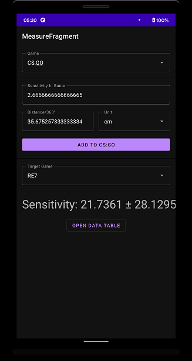

# Sensitivity Calculator

Store your sensitivity from your favorite game and compute the new sensitivity for your next game.

## Screenshots

## TODO

- [ ] Polynomial Regression degree 2 instead of "Assuming the relation between sensitivity and Distance/360° is linear and f(sensitivity=0) = 0"
- [ ] Measurement using AR
- [ ] Centralized database ? Sharing ? 
- [ ] Export/Import database using json
- [ ] Better guide (using tooltip)
- [ ] Docs